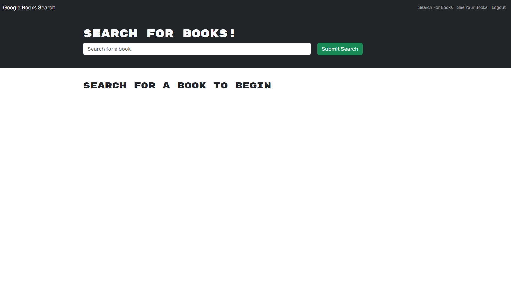

# book-search-engine

I started this project and was given a fully completed Rest API book-search engine and I changed it into a GraphQL API. I learned a lot about GraphQL and also had to fully understand the REST API to convert it successfully. I also learned how to use ApolloServer to create my Queries and Mutations easily.

## Table of Contents

- [Installation](#installation)
- [Usage](#usage)
- [Deployment](#deployment)
- [Authors](#authors)
- [License](#license)

## Installation

N/A

## Usage

All you need to do is click the link and if you would like to save books you must signup first but if you just want to look at them no signup is required.

## Deployment

- [book-search-engine](https://cshep-book-search-b57766c5f44d.herokuapp.com/)

## Authors

- [@collinshepherd](https://www.github.com/collinshepherd)

## License

